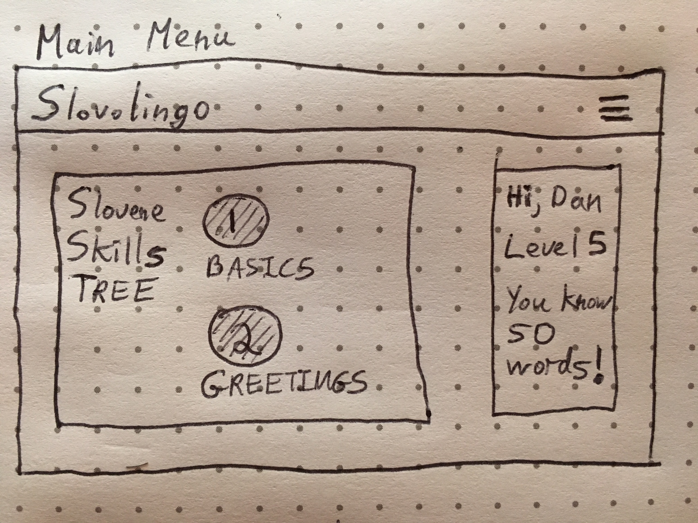
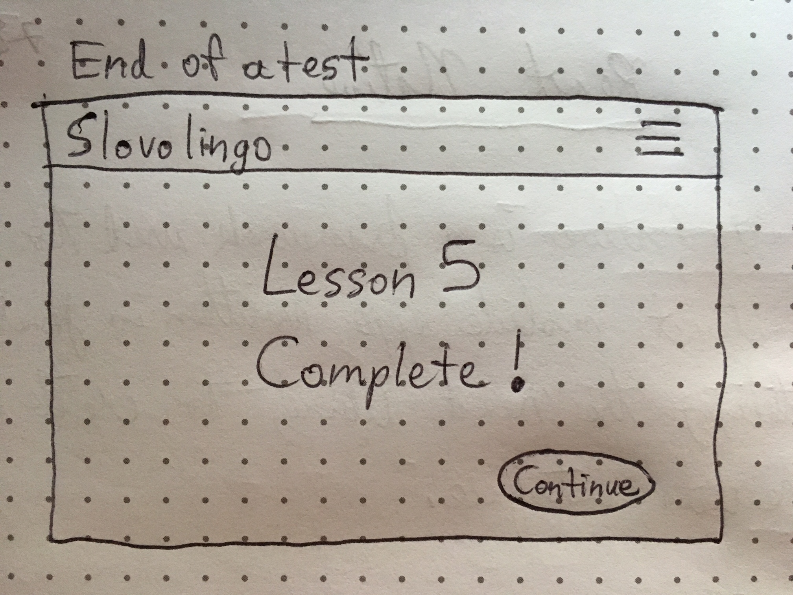

*** Daniel W. Beebe / Monday, September 11, 2017 ***

# 'Slovolingo' App Proposal

## What is 'Slovolingo'?

Slovolingo is an app inspired by Duolingo which allows users to learn [Slovene, the language of Slovenia](https://en.wikipedia.org/wiki/Slovene_language).

Each new user will need to register. Visiting users can login.

After logging in, the user will be directed to the main page, which contains the 'tree' of levels for learning Slovene. Moving up each level requires taking a quiz until the user has passed. Each quiz is multiple choice, with a word in English shown and 3 words in Slovene to choose from as the proper translation. When the User clicks on the right word, an audio clip pronouncing the word will play.

After taking the quiz for level 1, the quiz for level 2 will become available. The same for levels 2, 3, etc. Any previously-completed quizzes can also be taken again for practice.

The app will include 5 levels, teaching/testing the user on: (1) basics, (2) greetings, (3) family, (4) numbers, and (5) time.

On the main page header there will be a drop-down menu with links to an "about the app" page and an option to logout.

## Wireframes

After logging in, the user will see the main screen. On the left, the user will see the "tree" of tests the user must take to level-up, gaining skills in the Slovene language. On the right, the user's name, level, and number of words learned are displayed.

Each level will have a test with approximately 10 words to learn. The test is multiple-choice, with 3 possible answers to click on. The quiz is not over until the user gets everything right. This allows the user to learn by making mistakes and then being asked the same question again until everything is correct.

At the end of the quiz, the user graduates to the next level.

## Technologies

Slovolingo will be made using React and Express. The app will use PostgreSQL for the database of questions and to track the user's progress.

## Phases of Completion

* Phase -6 (9/12): Auth
* Phase -5 (9/13): Components & Routing
* Phase -4 (9/14): Database
* Phase -3 (9/15): Quiz Logic
* Phase -2 (9/16): Debugging
* Phase -1 (9/17): CSS Style 
* Phase 0 (MVP) (9/18): Deploy on Heroku
* Phase 1 (9/19): Improvements to style/substance

## Resources

[Duolingo - for style](https://www.duolingo.com/)

[Slovenian101](http://www.101languages.net/slovenian/slovenian-vocabulary-lessons/)

[Pirnat-Greenberg, Colloquial Slovene, The Complete Course for Beginners](https://www.amazon.com/Colloquial-Slovene-Complete-Course-Beginners/dp/0415559820)

[Colloguial Languages Site](http://www.routledgetextbooks.com/textbooks/colloquial/language/slovene.php)

[Learn Slovenian](http://learnslovenian.net/)

[50 Languages Site](http://www.goethe-verlag.com/book2/EN/ENSL/ENSL003.HTM)
