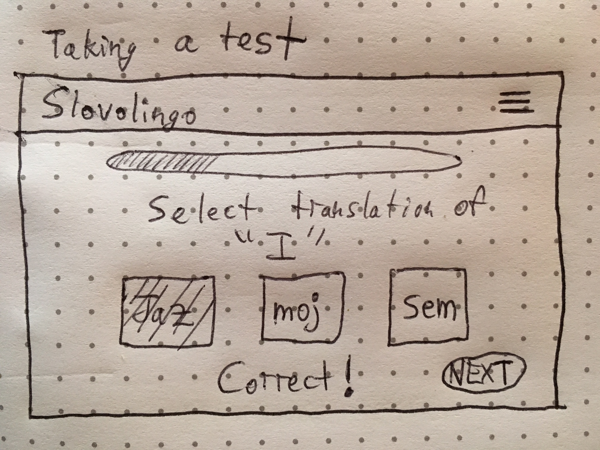

*** Daniel W. Beebe / Monday, September 11, 2017 ***

# 'Slovolingo' App Proposal

## What is 'Slovolingo'?

Slovolingo is an app modeled after Duolingo which allows users to learn Slovene, the language of Slovenia.

The app will include 5 levels, teaching/testing the user on: (1) basics, (2) greetings, (3) family, (4) numbers, and (5) time.

## Wireframes

After logging in, the user will see the main screen. On the left, the user will see the "tree" of tests the user must take to level-up, gaining skills in the Slovene language. On the right, the user's name, level, and number of words learned are displayed.

Each level will have a test with approximately 10 words to learn. The test is multiple-choice, with 3 possible answers to click on. The quiz is not over until the user gets everything right. This allows the user to learn by making mistakes and then being asked the same question again until everything is correct.

At the end of the quiz, the user graduates to the next level.

## Technologies

Slovolingo will be made using React and Express. The app will use PostgreSQL for the database of questions and to track the user's progress.

## Phases of Completion

* Phase -6 (9/12): Auth
* Phase -5 (9/13): Components & Routing
* Phase -4 (9/14): Database
* Phase -3 (9/15): Quiz Logic
* Phase -2 (9/16): Debugging
* Phase -1 (9/17): CSS Style 
* Phase 0 (MVP) (9/18): Deploy on Heroku
* Phase 1 (9/19): Improvements to style/substance
