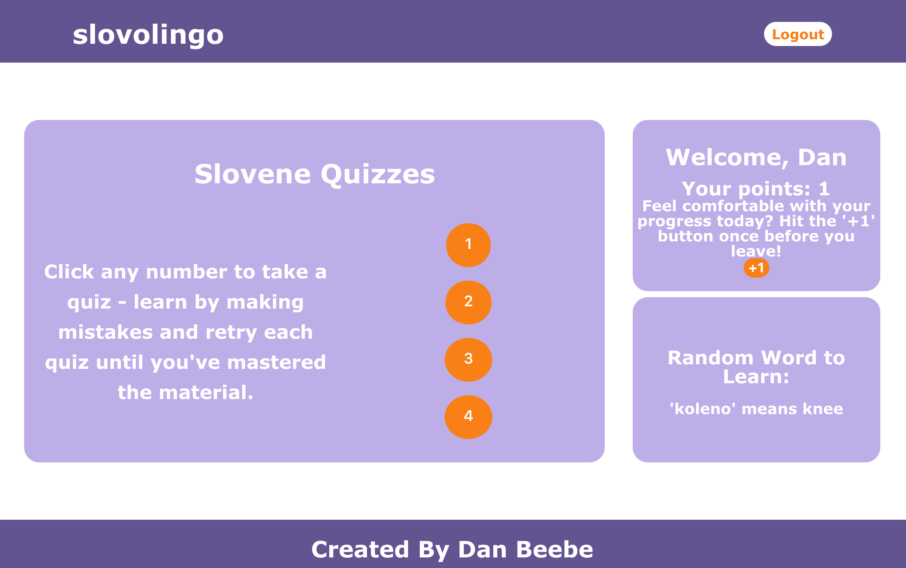
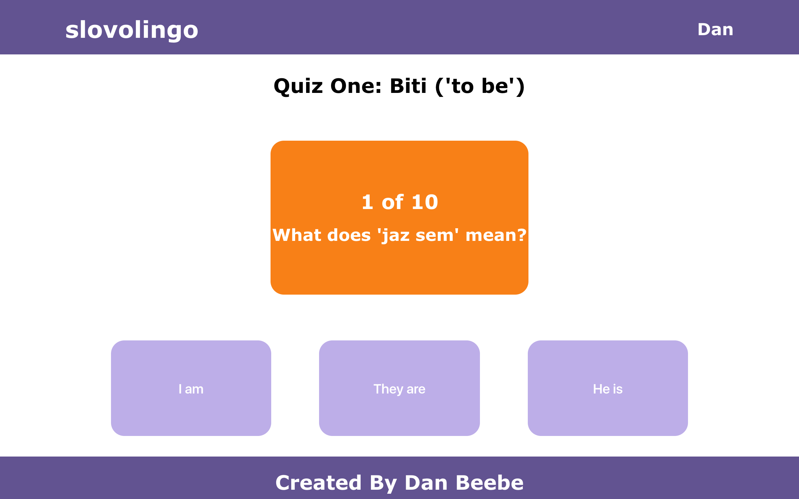

# 'Slovolingo' App

## What is 'Slovolingo?'

Slovolingo is an app inspired by Duolingo which allows users to learn Slovene, the language of Slovenia.

To begin, a new user can register with a username, email address, and password. After, the user can login to enter the main page. 

On the main page, the user sees three sections. The left side of the page contains a box with several buttons linking to quizzes on Slovene topics (to be, greetings, days of the week, and numbers). Clicking a link takes the user to the quiz. The upper right corner of the main page contains a box welcoming the user and displaying the user's points. The points system is based on self-evaluation - if the user feels an additional point has been earned by a successful visit, the user can click the '+1' button to add another point, which is recorded in the database. Finally, the lower right side of the main page contains a box with a random slovene word to learn. This word updates every time the user returns to the main page.

On each quiz page, the user sees the topic at the top of the page. Under the topic, there is a box containing a question, such as "What does 'jaz sem' mean?"  Under the question are 3 boxes with posisble answers. The order of these possible answers is determined randomly so it changes each time the quiz is taken. If the user clicks a wrong answer, a knocking sound is played so the user knows it was a wrong answer. If the user clicks the right answer, a ringing sound plays and the quiz moves on to the next question. For each question, an audio clip of the pronunciation is played. Each clip is a recording of my pronouncing the word.

After a quiz is done, the user can navigate back to the main page by clicking 'slovolingo' in the upper left corner of the screen. From there, the user can logout by clicking the button in the upper right corner of the main page.

Slovolingo is deployed at: https://slovolingo.herokuapp.com/

## Technical Discussion

Slovolingo is an app constructed using React and Express.js.

### Notes on App Structure

[TO BE ADDED]

### Sample Code

[TO BE ADDED]

## Making the App

[TO BE ADDED]

## Opportunities for Future Growth

[TO BE ADDED]

