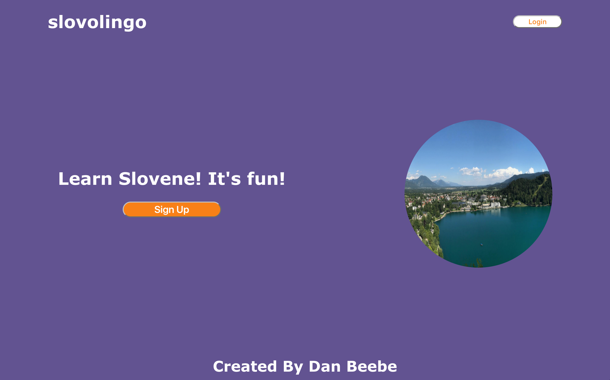

# 'Slovolingo' App

## What is 'Slovolingo?'

Slovolingo is an app inspired by Duolingo which allows users to learn Slovene, the language of Slovenia.

Slovolingo is deployed at: https://slovolingo.herokuapp.com/

## Technology

Slovolingo is an app constructed using React and Express.js.
